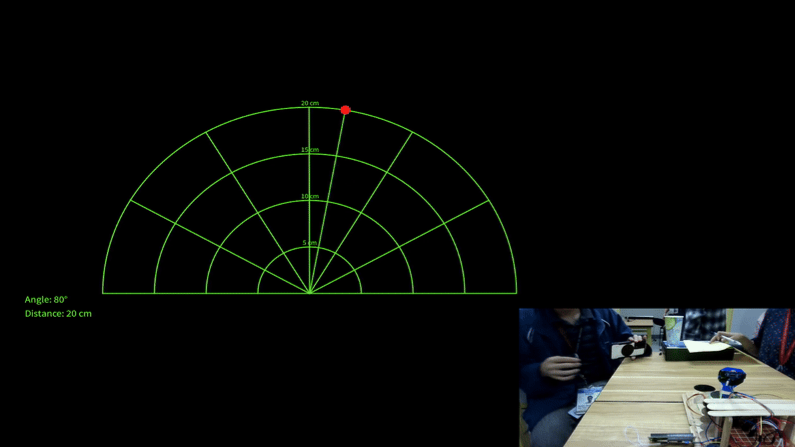

# Ultrasonic_radar

The first file is the Arduino sketch for the hardware

The second file contains the code for Processing IDE to show the radar within the specified distance

DEMO

Q. What does it do?

A. It detects object within the specified distance. When an object is detected the radar will stop and measure the distance of the object as well as the angle on where the radar stopped.
